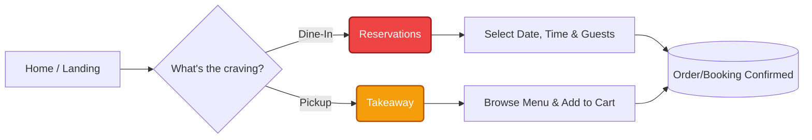
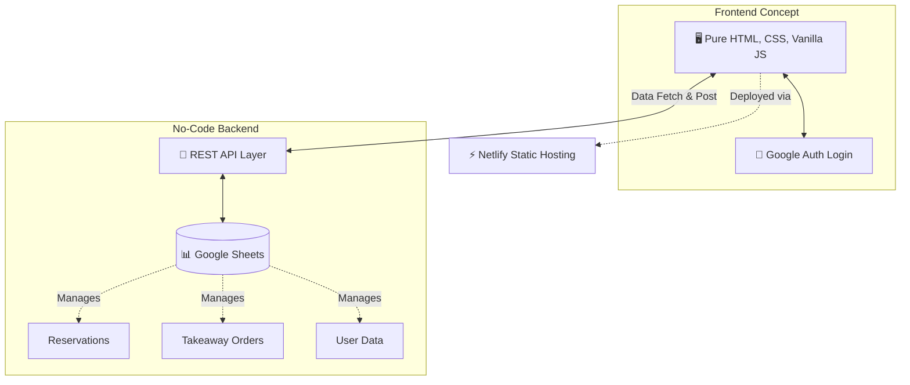

<div align="center">

<!-- Image placeholder: Replace the link below with your actual banner or logo -->


# Italiana
*Modernizing the legacy Italian restaurant experience.*

[]()
[]()
[]()

**Discover • Reserve • Order • Enjoy**

</div>

---

## 🍕 Core Vision

**Italiana** is a full-stack restaurant web experience designed to bring a legacy Italian restaurant's online presence into the modern era. It covers everything from menu discovery to reservations, takeaway ordering, and payments in a single, cohesive interface.

---

## 🍽️ What Italiana Offers

| Page / Flow | Description |
| :--- | :--- |
| 🏠 **Landing & Home** | First impression, hero section, featured dishes, and key CTAs (`index.html`). |
| 📜 **Menu** | Structured categories, detailed dish descriptions, and pricing (`menu.html`). |
| 📅 **Reservations** | Seamless table booking flow capturing date, time, and guest details (`reservation.html`). |
| 🥡 **Takeaway** | Dedicated ordering flow for quick and easy pickup orders (`takeaway.html`). |
| 📍 **Branches** | Directory of restaurant locations with contact and address details (`branches.html`). |
| 👤 **Account & Login** | Google Auth integration for user profiles and personalized experiences (`account.html`, `login.html`). |
| ℹ️ **Contact & About** | The restaurant's story, contact options, and basic information (`contact.html`, `about.html`). |

---

## 🗺️ User Journey

Whether a customer wants to dine in or grab a quick bite to go, the app guides them through a frictionless flow:



---

## ⚙️ Tech Stack & Architecture

Italiana is built to be lightweight, incredibly fast, and easy for restaurant owners to manage without complex databases.



### 🛠️ Core Technologies
*   **Frontend:** Pure HTML, CSS, and Vanilla JavaScript (`app.js`, `style.css`) split across multiple dedicated pages.
*   **Backend Strategy:** Designed to integrate with a no-code Google Sheets backend exposed via REST API.
*   **Authentication:** Google Auth integration for the full-stack version.
*   **Deployment:** Netlify (Static Hosting + API integration).

---

## 🚀 How to Run (Prototype)

Because this is a static-frontend project, getting it running locally is instantaneous:

1. **Clone the repository:**
```bash
   git clone [https://github.com/yourusername/italiana.git](https://github.com/yourusername/italiana.git)
   cd italiana
   ```
2. **Launch the app:** Open `index.html` directly in your browser, or serve it via a simple static server (like VS Code Live Server).
3. **Backend Connection:** Connect it to the corresponding backend/Google Sheets API (if configured) via your `app.js` endpoints.

---

## 🎯 Project Purpose & Roadmap

Italiana serves as a robust portfolio-level project demonstrating:
- UI/UX design explicitly tailored for restaurant experiences.
- Clean, multi-page HTML/CSS/JS structuring.
- Integration mindset utilizing no-code backends and modern auth.

### 🛣️ Future Enhancements
- [ ] **Online Payments:** Integrate a payment gateway (e.g., Stripe/Razorpay) for takeaway orders.
- [ ] **Table Management:** Build an admin dashboard for restaurant staff to manage live table availability.
- [ ] **Analytics:** Dashboard for restaurant owners to track popular dishes and peak reservation times.

---

